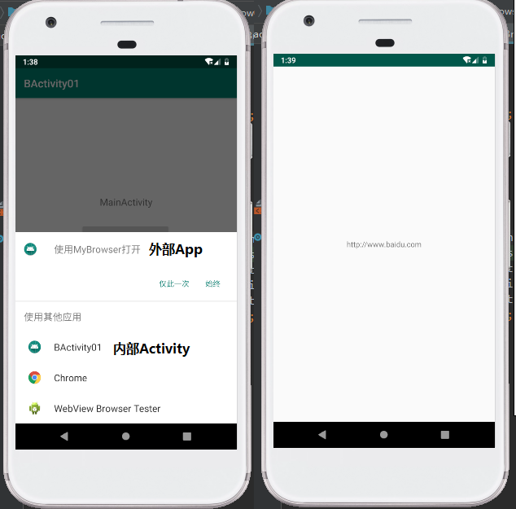

1. 实验0501:（本实验含两个project，工程命名后缀分别是0501x和0501y）
根据学习的视频5.4-5.6节案例，在2个工程中分别实现显示启动第2个Activity和隐式启动一个自定义的浏览器Activity。实验截图提交要求：分别将第一个主Activity界面（上面两个按钮）、显示启动后的第2个Activity、隐式启动自定义浏览器时系统提示的启动哪一个浏览器的那个提示截图、启动后的自定义浏览器界面等4个截图放在一个word里一起上传。
实验截图：  

  
  

2. 实验0502：
根据学习5.8节内容，实现借助Bundle大篮子类，首先捆绑起数据再利用Intent传输的方法，显示启动第二个Activity。实验截图要求：分别截取第一个Activity的初始页面、跳转到第2个Activity页面后含有Toast显示获取过来的“姓名和年龄”信息提示的那个页面。
实验截图：  

  

3. 实验0503：
根据学习5.9节内容，实验实现Activity界面的跳转和携带数据再返回。返回第一个界面的数据由教学视频中的“数据来自OtherActivity”自定义改为“数据来自OtherActivityXXX”，XXX为你的姓名汉字。实验截图要求：分别截取第一个Activity（还未启动第2个，也就没有数据返回时）、第2个Activity界面、数据返回显示在TextView上后的第一个Activity界面。
实验截图：  

