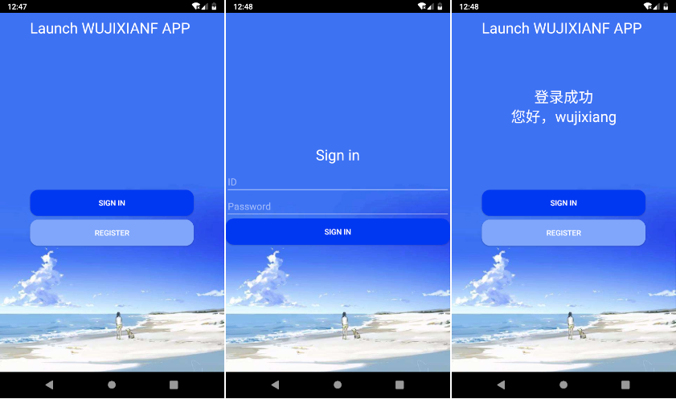
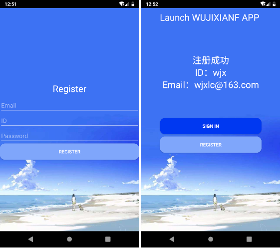

## Activity之登录案例的实现
&nbsp;&nbsp;&nbsp;&nbsp;&nbsp;&nbsp;主要借助Intent实现不同activity之间数据的跳转和回传数据。
1. Activity之间的跳转
    * ``startActivity(Intent);``Activity组件之间的跳转和数据的单向传递，
    * ``startActivityForResult(Intent intent,int requestCode);``跳转加数据的回传。数据的回传用到``setResult(Intent data,int resultCode)``

2. 回传数据的处理
    * ``onActivityResult(int requestCode, int resultCode, Intent data)``,注意请求码和结果码，结果码往往用于对于同一个请求不同结果的使用，请求码会自动回调。

## bug点
1. 项目改名后，app安装失败
当我对项目名称进行改名后，重新打开项目，AS_IDE会自动将之前的项目名配置更改为现在的，但是这远远不够，我在手机中卸载了之前的
应用，当我执行install时，会弹出提示框[installation failed,you must be uninstall...]大概意思就是安装该app之前必须卸载之前的
关键是我之前的已经卸载了，我点击OK，run error；我发现原因主要是命令的事情，每次安装都会附带之前项目(没有改名的)apk路径，因为底层就是命令去安装app，

**解决方法**
去除热部署，File->Settings->搜索Instant Run->将Enable Instant Run to hot swap code取消勾选->apply;重启应用，问题解决！

案例截图

