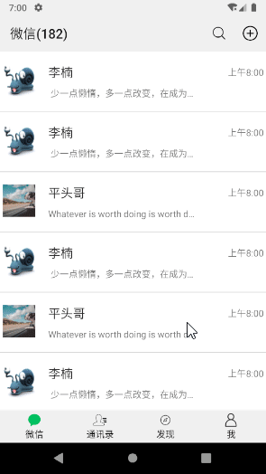

# WeChatUI

首先看下效果吧！

  


**实现的难点**：

**1. 沉浸式导航栏的实现**

沉浸式的实现，结合网上案例，然后不断写bug，然后再debug，终于实现沉浸式，并且状态栏的阴影也去除了。

主要借助了**toolbar**，它是在android5.0之后推出的，比ActionBar更给力。

```xml
<android.support.v7.widget.Toolbar
        android:id="@+id/toolbar"
        android:layout_width="match_parent"
        android:layout_height="wrap_content"
        android:background="#F0F0F0"
        android:fitsSystemWindows="true"
        android:layout_marginBottom="3dp">
		<!--TextView 设置layout_gravity属性可以设置标题居中-->
        <TextView
            android:layout_width="wrap_content"
            android:layout_height="wrap_content"
            android:layout_gravity="center"
            android:text="主标题"
            android:textColor="@android:color/background_dark"
            android:textSize="17sp" />
    </android.support.v7.widget.Toolbar>
```

请参考[android Toolbar完全解析](https://www.jianshu.com/p/ae0013a4f71a)

android 5.0去除状态栏阴影，并且可以设置状态栏的字体颜色。默认情况下状态栏的字体颜色为白色，假若我app的主题风格为白色，那么很有可能导致状态栏通知不能被肉眼所识别，因为都是白色的。其他主题色还可以，能够反映出白色，但白色主题就不行。所以说这时候就必须对状态栏字体颜色进行修改。

```java
/**
     * 浸入式状态栏实现同时取消5.0以上的阴影
     */
protected void setStatusBar() {
    if (Build.VERSION.SDK_INT >= Build.VERSION_CODES.LOLLIPOP) {//5.0及以上
        View decorView = getWindow().getDecorView();
        getWindow().clearFlags(WindowManager.LayoutParams.FLAG_TRANSLUCENT_STATUS
                               | WindowManager.LayoutParams.FLAG_TRANSLUCENT_NAVIGATION);
        int option = View.SYSTEM_UI_FLAG_LAYOUT_FULLSCREEN
            | View.SYSTEM_UI_FLAG_LAYOUT_STABLE;
        decorView.setSystemUiVisibility(option);
        getWindow().addFlags(WindowManager.LayoutParams.FLAG_DRAWS_SYSTEM_BAR_BACKGROUNDS);
        getWindow().setStatusBarColor(Color.TRANSPARENT);
    } else if (Build.VERSION.SDK_INT >= Build.VERSION_CODES.KITKAT) {//4.4到5.0
        WindowManager.LayoutParams localLayoutParams = getWindow().getAttributes();
        localLayoutParams.flags = (WindowManager.LayoutParams.FLAG_TRANSLUCENT_STATUS | localLayoutParams.flags);
    }
    //修改字体颜色
    if (Build.VERSION.SDK_INT >= Build.VERSION_CODES.M) {//android6.0以后可以对状态栏文字颜色和图标进行修改
        getWindow().getDecorView().setSystemUiVisibility(View.SYSTEM_UI_FLAG_LAYOUT_FULLSCREEN | View.SYSTEM_UI_FLAG_LIGHT_STATUS_BAR);
    }
}
```

请参考

[Android关于沉浸式状态栏的一些总结](https://www.jianshu.com/p/752f4551e134)

[android5.0消除状态栏阴影](https://www.jianshu.com/p/752f4551e134)

**2. svg图片的修改**

app采用的图标都是svg格式的，但是因为要同一个图标绘制不同状态的形式，脑袋大了。ps默认不能将图片转svg格式，必须下载ps-to-svg.jsp插件（可能叫这个），下载之后做好配置还是不管用。后来用的Adobe Illustrator，刚开始上手不会，我的目的很简单，就是将图片重新绘制一下改变一下颜色，后来学会了使用钢笔工具，顺风顺水的做完了，:joy:，成功绘制出了两套不同状态下的svg，说实话还是svg格式的图片省空间，你们实际可以对比一下。

ViewPager+Fragment+RecyclerView结合使用


