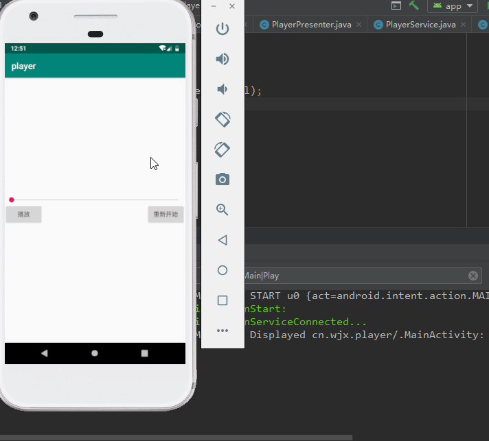

  

1. 接口定义  
``IPlayerControl``service服务，实现音乐播放控制逻辑；``IPlayerViewControl``UI控制，主要完成界面UI的渲染；逻辑层代码中依靠UI控制类去实时改变UI。  
2. UI界面的编写与服务绑定  
主界面主要包括三个控件，找到相应控件并设置相应的监听，activity中以start开启之后还要绑定服务，确保组件进行通信的同时后台线程能够存活。绑定服务建立连接之后获得Binder对象**IPlayerControl** ,Binder对象？因为PlayerPresenter类继承了Binder并且实现了IPlayerControl，从这可以体会到接口开发的好处，不去关心子类是什么，我只管调用接口中的方法，至于你是如何实现的，I don't care.  得到IPlayerControl之后，因为需要IPlayerViewControl控制视图，所以registerViewControl(匿名内部类实现)，因为也是一个接口，接口回调的方法在匿名内部类中。**接口为回调提供了入口**，之后就是在MainActivity中调用相应的接口方法完成相应的UI控制。  
3. UI控制逻辑层代码  
```
public class PlayerPresenter extends Binder implements IPlayerControl {

    private static final String TAG = "PlayerPresenter";
    private int currentPlayerState = PLAY_STATE_STOP;

    private IPlayerViewControl mPlayerViewControl;
    private MediaPlayer mMediaPlayer;
    private Timer mTimer;
    private SeekTimeTask mSeekTimeTask;

    @Override
    public void registerViewControl(IPlayerViewControl playerViewControl) {
        this.mPlayerViewControl = playerViewControl;
    }

    @Override
    public void unRegisterViewControl() {
        mPlayerViewControl = null;
    }

    @Override
    public void playOrPause() {
        Log.d(TAG, "playOrPause: ");

        if (currentPlayerState == PLAY_STATE_STOP) {
            // 创建一个播放器
            initMediaPlayer();
            // 设置数据源
            try {
                mMediaPlayer.setDataSource("/mnt/sdcard/song.mp3");
                mMediaPlayer.prepare();
                mMediaPlayer.start();
                currentPlayerState = PLAY_STATE_PLAY;
                startTimer();
            } catch (IOException e) {
                e.printStackTrace();
            }
        } else if (currentPlayerState == PLAY_STATE_PLAY) {
            mMediaPlayer.pause();
            stopTimer();
            currentPlayerState = PLAY_STATE_PAUSE;
        } else if (currentPlayerState == PLAY_STATE_PAUSE) {
            mMediaPlayer.start();
            startTimer();
            currentPlayerState = PLAY_STATE_PLAY;
        }
        if (mPlayerViewControl != null) {
            mPlayerViewControl.onPlayerStateChange(currentPlayerState);
        }

    }

    private void initMediaPlayer() {
        mMediaPlayer = new MediaPlayer();
        mMediaPlayer.setAudioStreamType(AudioManager.STREAM_MUSIC);
    }

    @Override
    public void stopPlay() {
        stopTimer();
        currentPlayerState = PLAY_STATE_STOP;
        // 释放资源
        Log.d(TAG, "stopPlay: ");
        if (mMediaPlayer != null && mMediaPlayer.isPlaying()) {
            mMediaPlayer.stop();
            mMediaPlayer.release();
            mMediaPlayer = null;
            if (mPlayerViewControl != null) {
                mPlayerViewControl.onPlayerStateChange(currentPlayerState);
                mPlayerViewControl.onSeekChange(0);
            }
        }
    }

    @Override
    public void seekTo(int progress) {
        Log.d(TAG, "seekTo: " + progress);
        if (mMediaPlayer != null) {
            int tarSeek = (int) (progress*1.0f/100*mMediaPlayer.getDuration());
            Log.d(TAG, "tarSeek: "+tarSeek);
            mMediaPlayer.seekTo(tarSeek);
        }
    }

    /**
     * 开启一个timerTask
     */
    private void startTimer() {
        if (mTimer == null) {
            mTimer = new Timer();
        }
        if (mSeekTimeTask == null) {
            mSeekTimeTask = new SeekTimeTask();
        }
        mTimer.schedule(mSeekTimeTask, 0, 500);
    }

    private void stopTimer() {
        if (mSeekTimeTask != null) {
            mSeekTimeTask.cancel();
            mSeekTimeTask = null;
        }
        if (mTimer != null) {
            mTimer.cancel();
            mTimer = null;
        }
    }

    private class SeekTimeTask extends TimerTask {

        @Override
        public void run() {
            // 获取当前的播放进度
            if (mMediaPlayer != null) {
                int currentPosition = mMediaPlayer.getCurrentPosition();
                Log.d(TAG, "current play position -- >" + currentPosition);
                Log.d(TAG, "duration -->" + mMediaPlayer.getDuration());
                // 将音频转化为进度条范围内的值 以进度条的进度值去改变进度
                int curPosition =(int) (currentPosition*1.0f / mMediaPlayer.getDuration()*100);
                Log.d(TAG, "current / duration -->" + curPosition);
                if (mPlayerViewControl != null) {
                    mPlayerViewControl.onSeekChange(curPosition);
                }
            }
         }
    }
}
```  
下面主要介绍几个难以实现的点：  
* 如何将音频的播放进度和SeekBar绑定起来，实现随音乐进度动态更新进度条
> 借助TimeTask和Timer类实现一个定时任务，然后根据MediaPlayer相应的API获取当前播放进度和音频的完整时长，因为之前设置了SeekBar的max=100，所以必须将**播放进度与音频的进度做一个逻辑运算**，计算不正确，可能导致播放的卡顿，拖动播放条会有一定的跳动等异常。  
* 进度条的拖动播放  
> 当实现了进度条的实时更新之后，拖动更新就是调用MediaPlayer的seekTo方法(进度的逻辑转化),因为存在定时任务，所以当拖动之后，定时任务会获取到当前进度然后从当前执行。  

注意点：
* android6.0+内存卡读取权限的动态获取  
可能你也在Manifest.xml中声明了读取内存卡的权限，但控制台就是报文件打开失败权限否认等异常，这时你就需要在代码中进行动态授权，之后问题就解决了。
* 主线程更新UI  
android不允许子线程更新UI，但是SeekBar和SurfaceView除外，解决方法
```
runOnUiThread(new Runnable() {
    @Override
    public void run() {
        update UI ...
    }
});
```