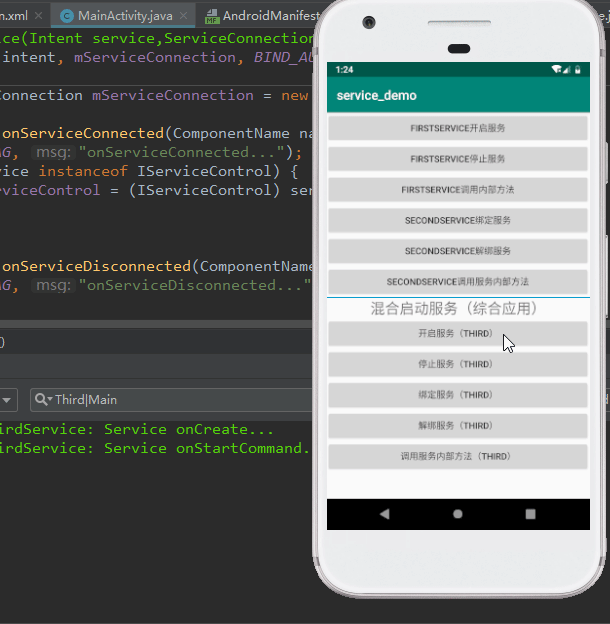
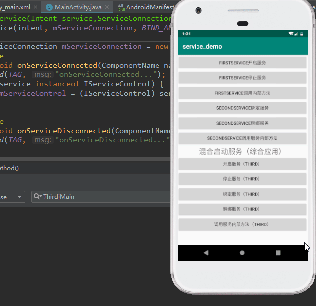
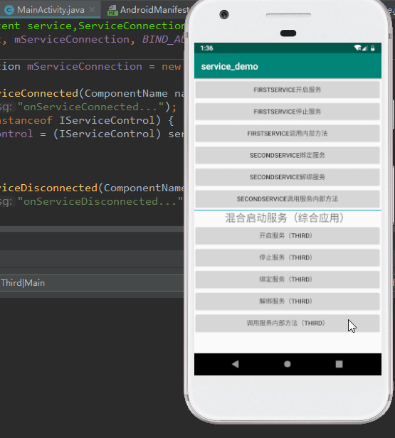

[1. 服务的概念](#p1)  
[2. 为什么使用服务](#p2)  
[3. 服务的使用](#p3)  
[4. Android跨进程通信AIDL](#p4)  
[5. AIDL模拟支付宝支付](#p5)
### <span id="p1">服务的概念</span>
    服务是一个可以长期在后台运行没有用户界面的应用组件。  
    服务可以由其他应用组件启动，比如activity，服务一  
    经启动，即使activity已销毁服务仍可正常运行于后台。
### <span id="p2">为什么使用服务？</span>
    服务并没有漂亮的界面，但是某些操作需要去做，比如
    耗时操作请求数据等异步工作，我们可以使用服务，放
    置后台，增强用户体验。
### <span id="p3">服务的使用：</span>
    服务属于四大组件之一，使用流程同其他组件如BroadcastReceiver很相似，  
    同样需要编写类继承组件相应的类或者实现接口，然后在Manifest声明注册  
    ，通过在Activity中借助Intent进行开启相应的组件。
- 编写Service类  
    - 编写类继承Service类，可以重写父类的方法，监听Service的生命周期变化，Service也是间接继承自Context的。
    - 在Manifest中注册服务，注意一个属性``android:exported="true"``说明该Service可以被外部所调用。
```
public class FirstService extends Service {
    public static final String TAG = "FirstService";
    @Override
    public IBinder onBind(Intent intent) {
        return null;
    }

    @Override
    public void onCreate() {
        super.onCreate();
        Log.d(TAG, "Service onCreate...");
    }

    @Override
    public int onStartCommand(Intent intent, int flags, int startId) {
        Log.d(TAG, "Service onStartCommand...");
        return super.onStartCommand(intent, flags, startId);
    }

    @Override
    public void onDestroy() {
        super.onDestroy();
        Log.d(TAG, "Service onDestroy...");
    }
}
```
- 服务的使用（两种方式）
    1.  停止启动服务  
        ``startService(Intent intent);``  
        ``stopService(Intent intent);``
    2.  绑定解绑服务  
        ``bindService(Intent intent, ServiceConnection conn, int flags)``  flags一般为**BIND_AUTO_CREATE**,conn一般为匿名匿名内部类。  
        ``unbindService(ServiceConnection conn)``;  
##### 两种方式的优缺点  
- start和stop开启和关闭服务，服务可以一直在后台（android9.0如果后台服务一直没有使用，那么它会自动调用destory方法使其service销毁，android.X  
之后具体哪个版本就不知道了），但是这种方式组件与组件之间不能正常进行的通信，复用上面的FirstService，添加一个方法，加Toast提示框，才能看见为什么不能通信，单独的一个函数调用，函数体为空是可以正常执行的，但当  给上下文的时候，会报异常  

    ``` 
     public void innerMethod() {
        Log.d(TAG, "innerMethod...");
        Toast.makeText(this, "say hello!", Toast.LENGTH_SHORT).show();
    }
    ```
    在Activity中开启服务并调用服务内部方法  
    ```
    FirstService firstService = new FirstService();
    firstService.innerMethod();
    ```
    开启服务后调用方法抛出空指针异常原因就是Toast中this上下文并没有获取到，因为Service是间接继承自Context，服务相当于一个后台进程，服务进程对  
    像的分配是由系统分配的，而不是人为控制。
    ```
    Caused by: java.lang.NullPointerException: Attempt to invoke virtual
    method 'java.lang.String android.content.Context.getPackageName()' o
    n a null object reference
    ```
- 绑定和解绑服务  
以bind方式开启的service，组件与组件之间可以通过extends Binder生成一个IBinder对象，activity和service组件之间就可以通过ServiceConnection建立连接进行通信，原理相当于C/S架构，Activity相当于客户端，Service相当于服务器。bindService(...)开启的服务，服务进程并不会一直运行于后台，当Activity销毁时要释放服务资源即unbind否则会导致泄露问题，也就是说service的与activity不求同生但求同死。
##### 混合使用服务  
1. 前面我们已经了解到服务有这么多的启动方式，接着我们对它进行组合，可以看到当服务通过start开启然后绑定后可以进行通信，按下返回键服务并不会销毁（图中并没有演示），这样保证了服务跑于后台并且能通信。

2. start->bind->unbind查看效果  
unbindService之后service并没有destroy，所以说以start开启服务之后，只有stop才可以正常的销毁服务。

3. start->bind->stop  
bind之后未unbind，stop是不会起作用的，也就是说当bind之后必须解绑才可以正常的释放资源。  


### <span id="p4">Android跨进程通信AIDL</span>
- AIDL概述  
AIDL意思即Android Interface Definition Language(安卓接口定义语言)，用于定义服务器与客户端进行通信的一种描述语言，本质是AIDL其实是android端为我们定义的一个模板文件.aidl，最终还是会编译为.java文件。  
在Android中，默认每个应用（application）执行在它自己的进程中，无法直接调用到其他应用的资源，这也符合**沙箱(SandBox)的理念**。所谓沙箱原理，一般来说用在移动电话业务中，简单地说旨在部分地或全部地隔离应用程序。  
    >Android沙箱技术：
    Android“沙箱”的本质是为了实现不同应用程序和进程之间的互相隔离，即在默认情况 下，应用程序没有权限访问系统资源或其它应用程序的资源。
    每个APP和系统进程都被分配唯一并且固定的User Id（用户身份标识），这个uid与内核层进程的uid对应。
    每个APP在各自独立的Dalvik虚拟机中运行，拥有独立的地址空间和资源。
    运行于Dalvik虚拟机中的进程必须依托内核层Linux进程而存在，因此Android使用Dalvik虚拟机和Linux的文件访问控制来实现沙箱机制，任何应用程序如果想要访问系统资源或者其它应用程序的资源必须在自己的manifest文件中进行声明权限或者共享uid。  
- AIDL的引入  
android开发中一项任务可能需要多个进程相互协作，相互委托，比如支付服务，某app需要进行支付，那么他需要调起第三方支付，进程之间需要通信，当支付完毕，第三方返回支付数据给app进程之间也需要通信，所以说如果一个应用只是单单的一个UI主进程而不涉及多个进程间的通信，那么这个app是不完美的！通过AIDL就可以满足进程间通信的需求，本质上也是通过Binder对象来进行传递数据。  
    >通常，**暴露接口方法**给其他应用进行调用的应用称为**服务端**，调用其他应用的方法的应用称为客户端，客户端通过绑定服务端的Service来进行交互。  

### <span id="p5">[AIDL模拟支付宝支付](https://blog.csdn.net/qq_30591155/article/details/105200843)</span>
1. 明确需求  
某app需要进行BitCoin充值，需要调用第三方支付服务，然后第三方支付服务拉起一个新的Activity提供用户账单信息并且具有支付功能。支付完毕后，第三方响应客户端，通过回调方法，给与用户支付操作成功与否信息。
2. 案例展示  
项目结构
  
演示  

3. 代码实现（核心代码）
    - 编写支付服务和支付界面（Server端）    
    Client通过bindService(Intent, ServiceConnection, int),实现ServiceConnection接口实现组件之间的通信，`public void onServiceConnected(ComponentName name, IBinder service) `方法中的IBinder对象就是Server通过调用onBind方法返回的一个间接继承Binder类的对象。私有内部类``ThirdPartPayImpl``继承``ThirdPartPayAction.Stub``**.Stub类**实现了[AIDL](#aidl)接口并且继承了Binder类（AIDL通信的本质）。PayAction支付动作类，因为app绑定第三方支付后，当调用requestPay时，service会拉起一个支付的[``PayActivity``](#PayAction),这个Activity也需要与该支付服务做绑定因为支付操作都是在该界面进行的，与服务通信的IBinder对象就是return new PayAction()所给。
    ```
    public class PayService extends Service {
        public static final String TAG = "PayService";
        private ThirdPartPayImpl mThirdPartPay;
    
        @Override
        public IBinder onBind(Intent intent) {
            String action = intent.getAction();
            Log.d(TAG, "onBind -- > action:" +action);
            if (action != null && "cn.wjx.alipay.THIRD_PART_PAY".equals(action)) {
                // 第三方应用调起支付服务
                mThirdPartPay = new ThirdPartPayImpl();
                return mThirdPartPay;
            }
            return new PayAction();
        }
    
        public class PayAction extends Binder {
            public void pay(float money) {
                Log.d(TAG, "pay--->" + money);
                if (mThirdPartPay != null) {
                    try {
                        mThirdPartPay.callBack.paySuccess();
                    } catch (RemoteException e) {
                        e.printStackTrace();
                    }
                }
            }
            public void onUserCancel() {
                Log.d(TAG, "onUserCancel");
                if (mThirdPartPay != null) {
                    try {
                        mThirdPartPay.callBack.payFailed(0, "用户取消");
                    } catch (RemoteException e) {
                        e.printStackTrace();
                    }
                }
            }
        }
    
        private class ThirdPartPayImpl extends ThirdPartPayAction.Stub {
            private ThirdPartPayResult callBack;
    
            @Override
            public void requestPay(String orderInfo, float money, ThirdPartPayResult result) throws RemoteException {
                this.callBack = result;
                // 第三方应用发起请求打开一个支付界面
                Intent intent = new Intent(PayService.this, PayActivity.class);
                intent.putExtra(Constants.PAY_ORDER_INFO, orderInfo);
                intent.putExtra(Constants.PAY_MONEY, money);
                // 服务通过intent调用activity，分开任务栈
                intent.setFlags(Intent.FLAG_ACTIVITY_NEW_TASK);
                startActivity(intent);
            }
        }
    }
    ```  
    <span id="aidl">AIDL文件</span>  
    <a href="#aidl_tag">AIDL知识点 click me</a>，requestPay方法中ThirdPartPayResult参数作为回调接口供客户端使用。说到这提下接口，接口可以隐藏内部细节，对调用者来说使用方便，对开发者来说接口使代码的健壮性增强，对调用者所使用的权限做了一定的限定。接口提高了开发效率，各端人员各司其职（**面向接口编程**）。
    ```
    package cn.wjx.alipay;
    import cn.wjx.alipay.ThirdPartPayResult;
    interface ThirdPartPayAction {
    void requestPay(String orderInfo,float money,ThirdPartPayResult result);
    }
    
    package cn.wjx.alipay;
    interface ThirdPartPayResult {
        void paySuccess();
        void payFailed(in int errorCode, in String errMsg);
    }

    ```  
    <span id="PayAction">PayActivity支付交互界面</span>
    ```
    public class PayActivity extends Activity {
    public static final String TAG = "PayActivity";
    private Button mPayCommit;
    private TextView mPayOrderInfo;
    private TextView mPayMoney;
    private EditText mPayPassword;
    private PayService.PayAction mPayAction;

    @Override
    protected void onCreate(Bundle savedInstanceState) {
        super.onCreate(savedInstanceState);
        setContentView(R.layout.activity_pay);
        initView();
        doPay();
    }
    private void doPay() {
        mPayCommit.setOnClickListener(new View.OnClickListener() {
            @Override
            public void onClick(View v) {
                if (mPayAction != null) {
                    String password = mPayPassword.getText().toString();
                    if ("123".equals(password)) {
                        mPayAction.pay(100f);
                        Toast.makeText(PayActivity.this, "支付成功 ", Toast.LENGTH_SHORT).show();
                        Log.d(TAG, "pay finish");
                        finish();
                    } else {
                        Toast.makeText(PayActivity.this, "密码错误", Toast.LENGTH_SHORT).show();
                    }
                }
            }
        });

    }
    @Override
    public void onBackPressed() {
        super.onBackPressed();
        mPayAction.onUserCancel();
        Toast.makeText(PayActivity.this, "取消支付", Toast.LENGTH_LONG).show();
    }
    /**
     * 初始化组件展示订单信息信息
     */
    private void initView() {
        Intent intent = getIntent();
        String payOrderInfo = intent.getStringExtra(Constants.PAY_ORDER_INFO);
        float payMoney = intent.getFloatExtra(Constants.PAY_MONEY, 0f);
        mPayCommit = findViewById(R.id.pay_commit);
        mPayOrderInfo = findViewById(R.id.pay_order_info);
        mPayOrderInfo.setText("账单：" + payOrderInfo);
        mPayMoney = findViewById(R.id.pay_money);
        mPayMoney.setText("支付金额：" + payMoney + "元");
        mPayPassword = findViewById(R.id.pay_password);
    }
    @Override
    protected void onStart() {
        super.onStart();
        Intent intent = new Intent(this, PayService.class);
        bindService(intent, mServiceConnection, BIND_AUTO_CREATE);
    }
    private ServiceConnection mServiceConnection = new ServiceConnection() {
        @Override
        public void onServiceConnected(ComponentName name, IBinder service) {
            if (service != null) {
                mPayAction = (PayService.PayAction) service;
            }
        }
        @Override
        public void onServiceDisconnected(ComponentName name) {

        }
    };

    /**
     * 解绑服务释放资源
     */
    @Override
    protected void onDestroy() {
        super.onDestroy();
        if (mServiceConnection != null) {
            unbindService(mServiceConnection);
            mServiceConnection = null;
        }
    }
    }
    ```  
    - 编写某App，导入AIDL接口文件  
    通过``ThirdPartPay.Stub.asInterface``得到第三方服务对象，继承``ThirdPartPayResult.Stub``重写回调接口方法，然后绑定服务的将相应对象传入即可。
    ```
    public class MainActivity extends AppCompatActivity {
    public static final String TAG = "MainActivity";
    private ThirdPartPayAction mPayAction;
    private TextView mUserAccount;

    @Override
    protected void onCreate(Bundle savedInstanceState) {
        super.onCreate(savedInstanceState);
        setContentView(R.layout.activity_main);
        initView();
    }

    private void initView() {
        mUserAccount = findViewById(R.id.user_account);
    }

    @Override
    protected void onStart() {
        super.onStart();
        Intent intent = new Intent();
        // android5.0以上必须显示启动服务
        intent.setAction("cn.wjx.alipay.THIRD_PART_PAY");
        intent.setPackage("cn.wjx.alipay");
        bindService(intent, mServiceConnection, BIND_AUTO_CREATE);
    }

    public void chargeBitCoin(View view) {
        try {
            mPayAction.requestPay("充值BitCoin", 9999F, new PayResult());
        } catch (RemoteException e) {
            e.printStackTrace();
        }
    }
    private ServiceConnection mServiceConnection = new ServiceConnection() {
        @Override
        public void onServiceConnected(ComponentName name, IBinder service) {
            Log.d(TAG, "onServiceConnected...");
            // 使用.Stub.asInterface转化对象
            mPayAction = ThirdPartPayAction.Stub.asInterface(service);
        }

        @Override
        public void onServiceDisconnected(ComponentName name) {

        }
    };

    private class PayResult extends ThirdPartPayResult.Stub {

        @Override
        public void paySuccess() throws RemoteException {
            // 支付成功 渲染界面 实际开发中是要请求服务器
            mUserAccount.setText("100BitCoin");
        }

        @Override
        public void payFailed(int errorCode, String errMsg) throws RemoteException {

        }
    }
    @Override
    protected void onDestroy() {
        super.onDestroy();
        if (mServiceConnection != null) {
            unbindService(mServiceConnection);
            mServiceConnection = null;
        }
    }
    }
    ```    
4. 项目中所遇到的问题  
    - 空指针异常  
        很常见的错误了，后来仔细排查，原因是在PayClient app下再绑定服务的时候传参错误，本来是继承ThirdPayResult.Stub类实现抽象方法传入该类的对象，而我直接将ThirdPartPayResult匿名对象传入，导致callback接口为空。  
    - 用户按下返回键取消支付时不能给出提示，并且报不能捕获远端异常  
        ```
        2020-03-30 14:14:54.928 8626-8642/cn.wjx.payclient E/JavaBinder:  
        *** Uncaught remote exception!  (Exceptions are not yet supported across processes.)  
        java.lang.RuntimeException: Can't toast on a thread that has not called Looper.prepare()
        ```  
        子线程更新UI的问题，我将toast放在Activit中更新UI，而不是在client调用之后，在client app下中AIDL回调接口中更新UI。
  
##### <span id="aidl_tag">AIDL小结</span>  
1. 文件类型：用AIDL书写的文件的后缀是 .aidl，而不是 .java。
2. 服务端和客户端的路径、文件名、内容一样，这样才能保证协议一致。
3. **数据类型**：AIDL默认支持一些数据类型，在使用这些数据类型的时候是不需要导包的，但是除了这些类型之外的数据类型，在使用之前必须导包，就算目标文件与当前正在编写的 .aidl 文件在同一个包下——在 Java 中，这种情况是不需要导包的。比如，现在我们编写了两个文件，一个叫做 Book.java ，另一个叫做 BookManager.aidl，它们都在 com.aoaoyi.aidldemo 包下 ，现在我们需要在 .aidl 文件里使用 Book 对象，那么我们就必须在 .aidl 文件里面写上 import com.aoaoyi.aidldemo.Book; 哪怕 .java 文件和 .aidl 文件就在一个包下。
4. **定向Tag**这是一个极易被忽略的点——这里的“被忽略”指的不是大家都不知道，而是很少人会正确的使用它。
AIDL中的定向 tag 表示了在跨进程通信中数据的流向，其中 in 表示数据只能由客户端流向服务端， out 表示数据只能由服务端流向客户端，而 inout 则表示数据可在服务端与客户端之间双向流通。其中，数据流向是针对在客户端中的那个传入方法的对象而言的。in 为定向 tag 的话表现为服务端将会接收到一个那个对象的完整数据，但是客户端的那个对象不会因为服务端对传参的修改而发生变动；out 的话表现为服务端将会接收到那个对象的的空对象，但是在服务端对接收到的空对象有任何修改之后客户端将会同步变动；inout 为定向 tag 的情况下，服务端将会接收到客户端传来对象的完整信息，并且客户端将会同步服务端对该对象的任何变动。
另外，Java 中的基本类型和 String ，CharSequence 的定向 tag 默认且只能是 in 。还有，请注意，请不要滥用定向 tag ，而是要根据需要选取合适的——要是不管三七二十一，全都一上来就用 inout ，等工程大了系统的开销就会大很多——因为排列整理参数的开销是很昂贵的
    
简易音乐播放器
[click me](https://gitee.com/wu_limit/android_coding_demo/tree/master/player)

    
        
    
    
    


